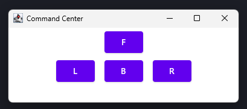

# MUS2 Projekt: Mars Rover

## Problembeschreibung

Die Kommunikation im All ist durch die enormen Distanzen stark latenzbehaftet. Diese Verzögerung in der Antwort sorgt dafür, dass man einen Marsrover nicht in Echtzeit manuell fernsteuern kann. Die Verzögerung zwischen dem Command Center auf der Erde und dem Mars Rover liegt je nach Stand der Planeten zwischen 3:25 Minuten und 22 Minuten. Problematisch wird dieser Fakt, sobald es Hindernisse gibt, gegen welche der Rover fahren könnte. Dementsprechend gilt es, die Fernsteuerung so resilient wie möglich zu gestalten.

Das Projekt versucht anhand eines Lego-Rover-Prototypen unter Verwendung des Arduinos, Sensoren und eines Servomotors dieses Problem zu simulieren. Desweiteren soll unter Verwendung von Ultraschallsensoren eine einfache Form der Kollisionsvermeidung erreicht werden.

## Lösungsansatz

Die Basis des Projekts stellt ein Rover zusammengebaut aus Klemmbausteinen der Marke Clementoni. Dessen Grundgerüst besteht aus drei Radachsen, einer Lenkanlage zur manuellen Richtungssteuerung und einem Elektromotor welcher den Rover vor- oder rückwärts treibt. Der Elektromotor wird durch eine Batterie gespeist.

Im ersten Teil des Projekts soll die Steuerung des Rovers durch ein "Command Center" ermöglicht werden. Dies soll ermöglicht werden, indem die Lenkanlage mithilfe eines Servomotors gesteuert wird. Dieser Servomotor ist wiederum mit einem Arduino verbunden, der dessen Steuerung übernimmt. Mittels MQTT empfängt der Arduino vom Command Center Commands, in welche Richtung dieser sich zu bewegen hat. Dieser Kommunikationsansatz ist deklarativ zu betrachten, da der Rover die Möglichkeit hat, aufgrund von Hindernissen zum Beispiel Commands außer Kraft zu setzen. Schlussendlich liegt es im Interesse der Menschheit, die Zerstörung eines Mars Rovers zu vermeiden.

Sobald die Steuerung des Rovers funktioniert, sollen Ultraschallsensoren installiert werden, die zur Obstacle Detection und Avoidance dienen sollen. Erkennen die Ultraschallsensoren einen Gegenstand, der in einer Entfernung unter dem Schwellwert liegen, soll die weitere Annäherung an dieses Objekt verhindert werden. In anderen Worten blockiert der Motor, wenn ein gefährliches Objekt erkannt wird.

## Implementierung

Die Implementierung des Rovers kann in drei Teile aufgespalten werden: Kommunikation, Command Center und der eigentliche Mars Rover. Die Implementierung dieser drei Teilbereiche erklärt diese Sektion näher.

### Kommunikation und Protokoll

Zur Verwendung wird wie bereits erwähnt MQTT verwendet. Das Steuerungsprotokoll ist so unkompliziert wird möglich gehalten. Jede Nachricht des Command Centers an den Rover besteht aus zwei Teilen: Direction und Velocity. Jeder dieser Teil wird durch jeweils einen Charakter repräsentiert.

Die Sektion Direction erlaubt vier verschiedene Richtungen F (Forward), B (Backwards), L (Left) und R (Right). Die Sektion Velocity ist als "Toggle" zu verstehen, denn es besteht aus den Commands B (Begin) und E (End).

Die Repräsentierung dieser Commands erfolgt im Command Center als Enum:
```kt
enum class Direction(val value: String) {
    F("F"),
    B("B"),
    L("L"),
    R("R")
}

enum class Velocity(val value: String) {
    B("B"),
    E("E")
}
```

Um das Protokoll besser zu verstehen ein Beispiel: Will ein User die Räder nach links stellen, so sendet dieser als erstes den Command `LB`. Daraufhin beginnt der Servomotor zu arbeiten und das Rad dreht sich. Soll das Wendemanöver beendet werden, sendet der User das Kommando `LE`, um die Lenkung nach links zu beenden.

Als Broker dient derselbe, der bereits aus der Übung bekannt ist: `broker.mqttdashboard.com` mit dem Topic `mus-rover/in-controls`.

### Command Center

Das Command Center dient zur Steuerung des Rovers und besteht aus einem einfachen MVP, der so simpel wie möglich gehalten ist, da dieser nur ein Mittel zum Zweck ist. Konkret sendet das Command Center Richtungs- und Beschleunigungskommandos an den MQTT Broker (wie in der Sektion Kommunikation und Protokoll beschrieben), von welchem der Rover wiederum dieselben Commands bezieht.

Die fertige Applikation besteht aus vier Richtungs-Buttons:



Zur Implementierung wurde Kotlin mit dem Desktop-App Framework *Desktop Compose* verwendet. Dies stellt eine deklarative Möglichkeit zur Definition von nativen Apps Desktop-Apps zur Verfügung. Die Definition von UI-Elementen ist dem Weg von React angepasst.

So kann zum Beispiel durch die folgende Funktion einer der vier Richtungs-Buttons definiert werden:
```kt
@Composable
fun DirectionalButton(direction: Direction) {
    val interactionSource = remember { MutableInteractionSource() }
    val pressed by interactionSource.collectIsPressedAsState()

    if (pressed) {
        println(direction.value + Velocity.B.value)
        sendMessage(direction, Velocity.B)

        DisposableEffect(Unit) {
            onDispose {
                println(direction.value + Velocity.E.value)
                sendMessage(direction, Velocity.E)
            }
        }
    }

    Button(
        onClick = {},
        interactionSource = interactionSource,
    ) {
        Text(direction.value)
    }
}
```

Durch einen Linksclick auf einen Richtungs-Button wird der Command `<Direction>B` an MQTT gesendet, um zu signalisieren dass die Bewegung in die Richtung nun beginnen soll. Beim loslassen des Linksclicks sendet das Command Center den Command `<Direction>E` um das Ende des Bewegungsvorganges zu signalisieren. 

Das Command Center verwendet die Bibliothek `io.github.davidepianca98:kmqtt-client`, welche MQTT Bindings für Kotlin zur Verfügung stellt. Die Erstellung des MQTT Clients erfolgt wie folgt:

```kt
private var client: MQTTClient = MQTTClient(
    MQTTVersion.MQTT5,
    "broker.mqttdashboard.com",
    1883,
    null,
    clientId = "control-center"
) { message ->
    println(message.payload?.toByteArray()?.decodeToString())
}
```

Das Veröffentlichen von Nachrichten ist dementsprechend auch sehr einfach und erfolgt mit folgender Funktion:
```kt
fun publish(message: String) {
    println("Publishing message to topic $topic: $message")
    client.publish(false, Qos.AT_MOST_ONCE, topic, message.encodeToByteArray().toUByteArray())
    client.step()
    println("Finish publish")
}
```


### Mars Rover

Um den Rover zu steuern, musste überlegt werden, wie man die Lego-Welt mit der echten Welt (allen voran den Servomotor) verbinden kann. Damit wurde es möglich, den Rover auch tatsächlich zu steuern. So wurde ein Lego Zahnrad an dem Servomotor befestigt, welches mittels anderen Zahnrädern und Verbindungsstäben die Lenkachse verschieben kann. Des weiteren, musste der Ultraschallsensor am Rover befestigt werden, so dass diese möglichst stabil sitzen und nicht vom Rover selbst verdeckt werden. Damit das alles möglich ist, musste der Rover umfangreich umgebaut werden, so dass der Arduino, das Steckbrett sowie der Servo und Ultraschallsensor am Rover platz finden. Um den Motor ansteuern zu können, wurde ein Motorcontrollerboard besorgt (siehe Abbildung unten), da ein einfaches Relais keine Rückwärtssteuerung erlaubt hätte.


Beim Motor selbst, mussten die Drähte, welche zum Schalter führen abgetrennt werden, damit diese an den Motorcontroller angeschlossen werden konnten. Leider hatten wir große Probleme, den Motor zum laufen zu bekommen, weswegen dieser Teil leider nicht erledigt werden konnte. Mehr dazu kann in der Sektion Ergebnisse anchgelesen werden.

Die Hauptschleife der Anwendung hat zwei Aufgaben. Die erste ist das Abfragen, ob ein neuer Befehl eingegangen ist und der zweite Teil ist für die Steuerung des Rovers zuständig. Da für das Endprodukt die Motorsteuerung nicht eingebaut werden konnte, fehlt diese. Die Hinderniserkennung wurde dementsprechend ebenfalls vereinfacht, so dass der Rover, sich nicht mehr bewegen kann, sobald ein Hindernis erkannt wurde. Das ist natürlich keineswegs eine Option in der echten Welt. Aufgrund des Problems mit der Motorsteuerung, haben wir uns jedoch für diese simplifizierung entschieden. Die Implementierung der Hauptschleife sieht wie folgt aus:
```arduino
void loop() {
  if (!mqttClient.connected()) {
    reconnect();
  }
  // receive message
  mqttClient.loop();

  if(shouldMove)
  {
    if(getDistanceCM(forwardDistancePin) < minDistance)
    {
      Serial.println("Obstacle detected. Cannot move");
      delay(20);
      return;
    }

    if (moveDirection == Direction::Right)
    {
      moveServo(steeringServo, true);
    }
    else if(moveDirection == Direction::Left)
    {
      moveServo(steeringServo, false);
    }
  }

  delay(20);
}
```

Wie im obigen Code-Ausschnitt zu sehen ist, wird zuerst überprüft, ob der Ultraschallsensor ein Hinderniss erkannt hat. Um mehrere Ultraschallsensoren verwenden zu können, muss der Pin des Sensors angegeben werden. Der Wert, welcher vom Ultraschallsensor zurückkommt, wurde in CM umgerechnet, um die Distanzprüfung zu vereinfachen. Im folgenden ist die Implementierung der Distanzberechnung zu sehen:
```arduino
int getDistanceCM(int distanceScannerPin) {
  long durationMs, cm;

  // Write to ultrasound sensor
  pinMode(distanceScannerPin, OUTPUT); // pin is now set to write mode
  digitalWrite(distanceScannerPin, LOW);
  delayMicroseconds(2);
  digitalWrite(distanceScannerPin, HIGH);
  delayMicroseconds(5);
  digitalWrite(distanceScannerPin, LOW);

  // Read from ultrasound sensor
  pinMode(distanceScannerPin, INPUT); // pin is now set to read mode
  durationMs = pulseIn(distanceScannerPin, HIGH);

  cm = microsecondsToCentimeter(durationMs);
  return cm;
}

long microsecondsToCentimeter(long microseconds) {
  // 340m/s or 29 microseconds per centimeter
  return microseconds / 29 / 2; // divided by 2 because sound also needs to travel back to us
}
```

Damit die Lenkung angesprochen werden kann, wurde eine Funktion entwickelt, um die Steuerung zu vereinfachen. Die Funktion übernimmt die Prüfung, ob der Motor seinen erlaubten Drehbereich nicht verlässt und setzt den Servo auf die neu berechnete Position. Wichtig anzumerken ist, dass diese Funktion, in jeder Iteration der Hauptschleife einmal ausgeführt wird. Diese Designentscheidung hat den Ursprung im Kommunikationsprotokol, da die Steuerung begonnen und danach beendet werden kann. Hier ist die Implementierung der Servosteuerung zu sehen:

```arduino
void moveServo(Servo &servoRef, bool forward) {
  int limit, stepsize;
  if(forward) {
    limit = 120; // pos is either 0 or -45
    stepsize = 1;
  } else {
    limit = -120; // pos is either 0 or 45
    stepsize = -1;
  }

  pos += stepsize;
  if((forward && pos > limit) || (!forward && pos < limit)) {
    pos = limit;
  }
  servoRef.write(pos);
  delay(50); // wait for servo to reach its position
}
```

Damit die Hauptschleife weis, wie der Rover angesteuert werden muss, werden globale Variablen verwendet. Diese werden in der Funktion gesetzt, welche für die Behandlung der MQTT Nachrichten zuständig ist. Diese liest die Nachricht, und interpretiert den Inhalt als Steuerungsbefehl. Die Implementierung war durch das einfach gewählte Protokoll, ebenfalls sehr minimal, wie hier zu sehen ist:
``` arduino
void onMessageReceive(char* topic, byte* payload, unsigned int length) {
  String command;
  for (int i=0;i<length;i++) {
    command.concat((char)payload[i]);
  }

  if(command.length() != 2) 
  { 
    // invalid command
    Serial.print("invalid command received. Command was: ");
    Serial.println(command);
    return; 
  } 

  switch (command[0]) {
    case 'F':
      moveDirection = Direction::Forward;
      break;
    case 'B':
      moveDirection = Direction::Backward;
      break;
    case 'L':
      moveDirection = Direction::Left;
      break;
    case 'R':
      moveDirection = Direction::Right;
      break;
    default:
      Serial.println("Received invalid direction");
  }
  switch (command[1]) {
    case 'B':
      shouldMove = true;
      break;
    case 'E':
      shouldMove = false;
      break;
    default:
      Serial.println("Received invalid start stop notification");
  }
}
```

## Ergebnisse

// Insert rover images here

// insert rover video here

// mqtt screenshots


Problemstellung

Die Kommunikation im All ist durch die enormen Distanzen stark latenzbehaftet. Diese Latenz sorgt dafür, dass man z.B. einen Marsrover nicht in Echtzeit manuell fernsteuern kann. Problematisch wird das, sobald es Hindernisse gibt, gegen welche dieser Rover fahren kann und wodurch dieses teure Gerät beschädigt wird. Unser Projekt versucht anhand eines Lego-Rover-Prototypen diese Problemlösung zu simulieren.

 

Lösungsansatz

Wir besitzen einen Rover zusammengebaut aus Klemmbausteinen der Marke Clementoni. Dieser kann zurzeit mit einem Zahnrad gelenkt werden. Ein Elektromotor erlaubt es dem Rover Vorwärts oder Rückwärts zu fahren. Der erste Schritt unserers Projektes ist es, diesen Rover mittels Arduino, Servomotoren und einer Desktop-App fernzusteuern. Im zweiten Schritt werden Ultraschallsensoren verwendet, um Hindernisse zu erkennen und den Rover anzuhalten, sollte dieser gegen das Hindernis gesteuert werden.

 

Erwartete Ergebnisse

Der Rover wird mittels eines Arduino und Servomotoren gesteuert. Die Steuerungsbefehle erhält der Arduino von einer Desktopanwendung, welche in Kotlin geschrieben ist. Die Kommunikation erfolgt dabei über Wlan mittels des MQTT-Protokolls. Ultraschallsensoren geben dem Arduino die nötigen Informationen, ob dieser die erhaltenen Steuerungsbefehle, ohne gegen ein Hindernis zu fahren, ausführen darf.
